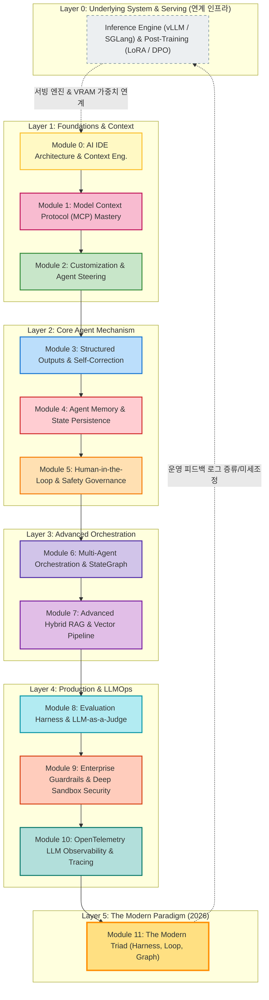

# 🚀 엔터프라이즈 에이전트 시스템 & LLMOps 오케스트레이션 마스터 클래스

[](https://www.python.org/)
[](https://langchain-ai.github.io/langgraph/)
[-green.svg)](https://modelcontextprotocol.io/)
[](https://docs.pydantic.dev/)
[](https://opentelemetry.io/)
[](LICENSE)

본 저장소는 **Google Antigravity IDE** 환경에서 글로벌 빅테크 수준의 **엔터프라이즈 에이전트 시스템(Agentic Systems) 및 LLMOps 오케스트레이션(Orchestration Engineering)**을 기초 이론부터 프로덕션 실무 코드까지 완벽하게 체득할 수 있도록 구축된 오픈소스 교육 저장소입니다.

> 🎓 **상세한 주차별 강의 계획 및 학습 목표가 필요하신가요?**  
> ➡️ [**강의 계획서 (curriculum.md) 바로가기**](curriculum.md)를 확인하세요.

---

## 📅 아키텍처 로드맵: 6대 계층 체계 (Layer 0 ~ Layer 5)

현대 AI 엔지니어링 스택은 하부 인프라(Layer 0)부터 시작하여 애플리케이션 오케스트레이션(Layer 1~3), 그리고 운영 및 패러다임(Layer 4~5)으로 유기적으로 연결됩니다.



---

## 📚 12개 핵심 모듈 매트릭스 (Curriculum Matrix)

모든 모듈은 **상세 이론 교재(`materials/`)**와 즉시 실행 가능한 **실전 파이썬 코드(`examples/`)**가 1:1로 완벽하게 매핑되어 있습니다.

| 계층 | 모듈 번호 및 주제 | 핵심 기술 스택 | 이론 교재 | 실전 실습 코드 |
| :--- | :--- | :--- | :---: | :---: |
| **Layer 1**<br/>(기초 & 컨텍스트) | **Module 0**: AI IDE Architecture & Context Eng. | Prompt Caching, KV-Cache, Context Compaction | [교재 보기](materials/00_context_engineering.md) | [00_context...py](examples/00_context_engineering_example.py) |
| | **Module 1**: Model Context Protocol (MCP) | FastMCP, Tools/Resources/Prompts, stdio | [교재 보기](materials/01_mcp.md) | [01_mcp_server.py](examples/01_mcp_server.py) |
| | **Module 2**: Customization & Steering | AGENTS.md, Dynamic Skill, Slash Commands | [교재 보기](materials/02_customization.md) | [.agents/AGENTS.md](.agents/AGENTS.md) |
| **Layer 2**<br/>(에이전트 엔진) | **Module 3**: Structured Outputs & Self-Correction | Pydantic v2, Reflection Loop, JSON Repair | [교재 보기](materials/03_structured_outputs.md) | [03_structured...py](examples/03_structured_outputs_example.py) |
| | **Module 4**: Memory & State Persistence | Short/Long-term Memory, Entity Extraction | [교재 보기](materials/04_agent_memory.md) | [04_agent_memory...py](examples/04_agent_memory_example.py) |
| | **Module 5**: Human-in-the-Loop & Governance | Breakpoints, Dangerous Tool Intercept | [교재 보기](materials/05_human_in_the_loop.md) | [05_hitl_example.py](examples/05_hitl_example.py) |
| **Layer 3**<br/>(오케스트레이션) | **Module 6**: Multi-Agent StateGraph | LangGraph, Handoff Swarm, Supervisor | [교재 보기](materials/06_multi_agent.md) | [06_orchestrator.py](examples/06_orchestrator.py) |
| | **Module 7**: Advanced Hybrid RAG & Pipeline | Dense+Sparse BM25, RRF, RBAC, HNSW | [교재 보기](materials/07_rag_vector_db.md) | [07_rag_example.py](examples/07_rag_example.py) |
| **Layer 4**<br/>(운영 & LLMOps) | **Module 8**: Evaluation Harness & LLM Judge | Deterministic Assertion, Rubric 1~5점 | [교재 보기](materials/08_evaluation_harness.md) | [08_eval_harness.py](examples/08_eval_harness.py) |
| | **Module 9**: Enterprise Guardrails & Sandbox | Firecracker MicroVM, Egress Drop, PII | [교재 보기](materials/09_guardrails_security.md) | [09_guardrails...py](examples/09_guardrails_example.py) |
| | **Module 10**: OpenTelemetry Observability | Distributed Tracing, Spans, Waterfall | [교재 보기](materials/10_observability_tracing.md) | [10_observability...py](examples/10_observability_example.py) |
| **Layer 5**<br/>(통합 패러다임) | **Module 11**: The Modern Agentic Triad | Circuit Breaker, State Rollback, Triad | [교재 보기](materials/11_modern_agentic_triad.md) | [11_triad_orchestrator.py](examples/11_triad_orchestrator.py) |

---

## ⚡ 빠른 시작 (Quick Start)

### 1. 저장소 클론 및 환경 설정
```bash
git clone https://github.com/eooiea/AI-Engineering.git
cd AI-Engineering

# 가상환경 생성 및 활성화
python -m venv .venv
source .venv/bin/activate  # Windows: .venv\Scripts\activate
```

### 2. 주요 실습 코드 원클릭 실행
```bash
# [Module 0] 토큰 80% 절약 프롬프트 캐싱 시뮬레이션
python examples/00_context_engineering_example.py

# [Module 3] Pydantic 기반 에러 자가 치유(Self-Healing) 루프
python examples/03_structured_outputs_example.py

# [Module 6] LangGraph 기반 기획자-작성자-검증자 오케스트레이터
python examples/06_orchestrator.py

# [Module 7] Dense + Sparse 하이브리드 RAG 및 RRF 순위 융합
python examples/07_rag_example.py

# [Module 8] 3단계 결정론적+LLM 판사 자동 채점 하네스
python examples/08_eval_harness.py

# [Module 11] 서킷 브레이커 & 하네스 통합 트라이어드 시뮬레이터
python examples/11_triad_orchestrator.py
```

---

## 📂 저장소 구조

```text
AI-Engineering/
├── README.md                    <-- 📖 본 프로젝트 소개 대시보드
├── curriculum.md                <-- 🎓 주차별 상세 실라버스 & 학습 계획서
├── materials/                   <-- 📚 12개 모듈별 상세 교재 (Markdown)
│   ├── 00_context_engineering.md
│   ├── 01_mcp.md
│   ├── 02_customization.md
│   ├── 03_structured_outputs.md
│   ├── 04_agent_memory.md
│   ├── 05_human_in_the_loop.md
│   ├── 06_multi_agent.md
│   ├── 07_rag_vector_db.md
│   ├── 08_evaluation_harness.md
│   ├── 09_guardrails_security.md
│   ├── 10_observability_tracing.md
│   └── 11_modern_agentic_triad.md
├── examples/                    <-- 🛠️ 12개 모듈 1:1 매칭 실습 코드 (Python)
│   ├── 00_context_engineering_example.py
│   ├── 01_mcp_server.py
│   ├── 03_structured_outputs_example.py
│   ├── 04_agent_memory_example.py
│   ├── 05_hitl_example.py
│   ├── 06_orchestrator.py
│   ├── 07_rag_example.py
│   ├── 08_eval_harness.py
│   ├── 09_guardrails_example.py
│   ├── 10_observability_example.py
│   └── 11_triad_orchestrator.py
└── .agents/                     <-- 🤖 에이전트 커스텀 시스템
    ├── AGENTS.md                <-- 상시 전역 개발 규칙
    ├── agents/                  <-- 전문 서브 에이전트 JSON 명세
    └── skills/                  <-- 온디맨드 전문 스킬
```

---
*License: MIT. Powered by Google Antigravity & Modern Agentic Engineering.*
