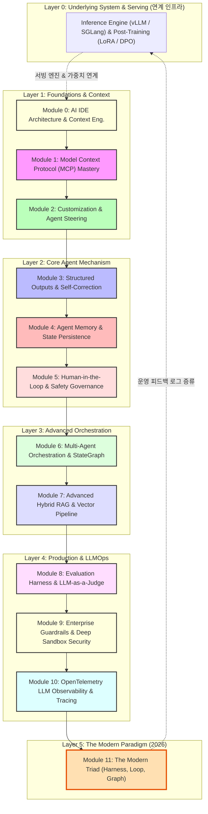

# 🚀 엔터프라이즈 에이전트 시스템 & LLMOps 오케스트레이션 마스터 클래스

[](https://www.python.org/)
[](https://langchain-ai.github.io/langgraph/)
[-green.svg)](https://modelcontextprotocol.io/)
[](https://docs.pydantic.dev/)
[](https://opentelemetry.io/)
[](LICENSE)

본 저장소는 **Antigravity IDE** 환경에서 **엔터프라이즈 에이전트 시스템(Agentic Systems) 및 LLMOps 오케스트레이션(Orchestration Engineering)**의 핵심 5대 계층을 기초 이론부터 프로덕션 실무 코드까지 완벽하게 마스터할 수 있도록 설계된 실무 중심 커리큘럼 및 실습 코드베이스입니다.

> [!NOTE]
> **엔터프라이즈 AI 시스템 전체 스택 내 본 교육 과정의 좌표**  
> 글로벌 AI 엔지니어링은 **1) 인프라/서빙 레이어(vLLM, PagedAttention, VRAM)**, **2) 에이전트 오케스트레이션 레이어(Context, MCP, StateGraph, Triad)**, **3) 데이터/미세조정 플라이휠(LoRA, Distillation, DPO)**로 구성됩니다.  
> 본 커리큘럼은 이 중 가장 복잡하고 비즈니스 부가가치가 높은 **'에이전트 오케스트레이션 및 LLMOps 운영 체계'**를 집중적으로 다루며, 인프라 및 모델 파인튜닝 파이프라인과의 프로덕션 연계 인터페이스를 체계적으로 안내합니다.

---

## 📅 커리큘럼 아키텍처 및 5대 계층 로드맵



---

## 📚 12개 핵심 모듈 안내

| 계층 | 모듈명 | 상세 이론 교재 | 실전 실습 코드 |
| :--- | :--- | :---: | :---: |
| **Layer 1**<br/>(Foundations) | **Module 0**: AI IDE Architecture & Context Engineering | [이론 문서](materials/00_context_engineering.md) | [00_context_engineering_example.py](examples/00_context_engineering_example.py) |
| | **Module 1**: Model Context Protocol (MCP) Mastery | [이론 문서](materials/01_mcp.md) | [01_mcp_server.py](examples/01_mcp_server.py) |
| | **Module 2**: Customization & Agent Steering | [이론 문서](materials/02_customization.md) | [.agents/AGENTS.md](.agents/AGENTS.md) |
| **Layer 2**<br/>(Core Agent) | **Module 3**: Structured Outputs & Self-Correction Loop | [이론 문서](materials/03_structured_outputs.md) | [03_structured_outputs_example.py](examples/03_structured_outputs_example.py) |
| | **Module 4**: Agent Memory & State Persistence | [이론 문서](materials/04_agent_memory.md) | [04_agent_memory_example.py](examples/04_agent_memory_example.py) |
| | **Module 5**: Human-in-the-Loop & Safety Governance | [이론 문서](materials/05_human_in_the_loop.md) | [05_hitl_example.py](examples/05_hitl_example.py) |
| **Layer 3**<br/>(Advanced) | **Module 6**: Multi-Agent Orchestration & StateGraph | [이론 문서](materials/06_multi_agent.md) | [06_orchestrator.py](examples/06_orchestrator.py) |
| | **Module 7**: Advanced Hybrid RAG & Vector Pipeline | [이론 문서](materials/07_rag_vector_db.md) | [07_rag_example.py](examples/07_rag_example.py) |
| **Layer 4**<br/>(LLMOps) | **Module 8**: Evaluation Harness & LLM-as-a-Judge | [이론 문서](materials/08_evaluation_harness.md) | [08_eval_harness.py](examples/08_eval_harness.py) |
| | **Module 9**: Enterprise Guardrails & Deep Sandbox Security | [이론 문서](materials/09_guardrails_security.md) | [09_guardrails_example.py](examples/09_guardrails_example.py) |
| | **Module 10**: OpenTelemetry LLM Observability & Tracing | [이론 문서](materials/10_observability_tracing.md) | [10_observability_example.py](examples/10_observability_example.py) |
| **Layer 5**<br/>(Paradigm) | **Module 11**: The Modern Agentic Triad (Harness, Loop, Graph) | [이론 문서](materials/11_modern_agentic_triad.md) | [examples/08_eval_harness.py](examples/08_eval_harness.py) |

---

## ⚡ 빠른 시작 (Quick Start)

### 1. 저장소 클론 및 환경 설정
```bash
git clone https://github.com/eooiea/AI-Engineering.git
cd AI-Engineering

# 가상환경 생성 및 활성화
python -m venv .venv
source .venv/bin/activate  # Windows: .venv\Scripts\activate
```

### 2. 주요 예제 실행해보기
```bash
# Module 0: 토큰 절약 프롬프트 캐싱 시뮬레이션
python examples/00_context_engineering_example.py

# Module 3: Pydantic 스키마 기반 자가 치유 루프
python examples/03_structured_outputs_example.py

# Module 6: 다중 에이전트 StateGraph 오케스트레이션
python examples/06_orchestrator.py

# Module 8: 3단계 평가 하네스 및 판사 채점
python examples/08_eval_harness.py

# Module 10: OpenTelemetry 분산 추적 시뮬레이션
python examples/10_observability_example.py
```

---

## 📂 디렉토리 구조

```text
AI-Engineering/
├── README.md                    <-- 📖 메인 소개 및 로드맵
├── curriculum.md                <-- 🎓 상세 커리큘럼 가이드
├── materials/                   <-- 📚 이론 학습 교재 (Module 0 ~ 11)
│   ├── 00_context_engineering.md
│   ├── 01_mcp.md
│   ├── 02_customization.md
│   ├── 03_structured_outputs.md
│   ├── 04_agent_memory.md
│   ├── 05_human_in_the_loop.md
│   ├── 06_multi_agent.md
│   ├── 07_rag_vector_db.md
│   ├── 08_evaluation_harness.md
│   ├── 09_guardrails_security.md
│   ├── 10_observability_tracing.md
│   └── 11_modern_agentic_triad.md
├── examples/                    <-- 🛠️ 모듈별 실습 코드
│   ├── 00_context_engineering_example.py
│   ├── 01_mcp_server.py
│   ├── 03_structured_outputs_example.py
│   ├── 04_agent_memory_example.py
│   ├── 05_hitl_example.py
│   ├── 06_orchestrator.py
│   ├── 07_rag_example.py
│   ├── 08_eval_harness.py
│   ├── 09_guardrails_example.py
│   └── 10_observability_example.py
└── .agents/                     <-- 🤖 에이전트 시스템 및 룰
    ├── AGENTS.md
    ├── agents/                  <-- 전문 서브 에이전트 JSON
    └── skills/                  <-- 워크스페이스 스킬
```

---
*License: MIT. Powered by Google Antigravity & Modern Agentic Engineering.*
