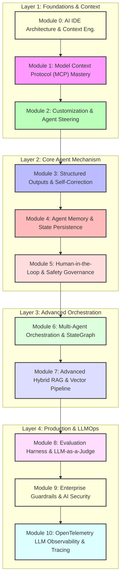

# 🚀 Antigravity와 함께하는 AI 엔지니어링 마스터 클래스

본 교육 과정은 **Antigravity IDE** 환경에서 엔터프라이즈 AI 엔지니어링의 핵심 4대 계층(**Foundations & Context**, **Core Agent Engine**, **Advanced Orchestration & RAG**, **Production & LLMOps**)을 기초 이론부터 프로덕션 실무 코드까지 마스터할 수 있도록 설계된 종합 커리큘럼입니다.

---

## 📅 10단계 커리큘럼 로드맵



---

## 📚 모듈별 상세 안내

### 🔹 Layer 1: 기초 및 컨텍스트 엔지니어링 (Foundations)

#### [Module 0: AI IDE Architecture & Context Engineering](file:///c:/Coding/AI-Engineering/materials/00_context_engineering.md)
* **이론**: Host-Model-Tools 3대 계층, Context Window 병목(Lost in the Middle), Prompt Caching(KV-Cache), 결정론적 scripts/ 전처리.
* **실습**: [examples/00_context_engineering_example.py](file:///c:/Coding/AI-Engineering/examples/00_context_engineering_example.py) 구동을 통한 80%+ 토큰 절감 및 캐싱 시뮬레이션.

#### [Module 1: Model Context Protocol (MCP) Mastery](file:///c:/Coding/AI-Engineering/materials/01_mcp.md)
* **이론**: MCP 표준 프로토콜, Tools/Resources/Prompts 3대 프리미티브, `stdio` vs `SSE Transport` 차이점.
* **실습**: [examples/01_mcp_server.py](file:///c:/Coding/AI-Engineering/examples/01_mcp_server.py) FastMCP 기반 도구/리소스/프롬프트 서버 구축 및 IDE 연동.

#### [Module 2: Customization & Agent Steering](file:///c:/Coding/AI-Engineering/materials/02_customization.md)
* **이론**: 상시 전역 규칙(`AGENTS.md`) vs 동적 스킬(`SKILL.md`), Dynamic Tool Selection (2단계 메타 툴 검색), 생산성 슬래시 커맨드.
* **실습**: 워크스페이스 전역 규칙([.agents/AGENTS.md](file:///c:/Coding/AI-Engineering/.agents/AGENTS.md)) 및 전문 스킬([review-code](file:///c:/Coding/AI-Engineering/.agents/skills/review-code/SKILL.md), [commit-msg](file:///c:/Coding/AI-Engineering/.agents/skills/commit-msg/SKILL.md)) 연동.

---

### 🔹 Layer 2: 에이전트 핵심 메커니즘 (Core Agent Engine)

#### [Module 3: Structured Outputs & Self-Correction Loop](file:///c:/Coding/AI-Engineering/materials/03_structured_outputs.md)
* **이론**: Grammar-based Decoding, Pydantic 스키마 강제, 런타임 오류 시 Reflection/Self-Healing(자가 치유) 루프.
* **실습**: [examples/03_structured_outputs_example.py](file:///c:/Coding/AI-Engineering/examples/03_structured_outputs_example.py) 에러 피드백 주입을 통한 자가 코드 수정 파이프라인.

#### [Module 4: Agent Memory & State Persistence](file:///c:/Coding/AI-Engineering/materials/04_agent_memory.md)
* **이론**: Short-term(Sliding Window/Summary), Long-term(Key-Value/Vector), Entity Memory 추출 및 영속 저장.
* **실습**: [examples/04_agent_memory_example.py](file:///c:/Coding/AI-Engineering/examples/04_agent_memory_example.py) 세션 간 엔티티 기억 및 대화 압축 시뮬레이터.

#### [Module 5: Human-in-the-Loop & Safety Governance](file:///c:/Coding/AI-Engineering/materials/05_human_in_the_loop.md)
* **이론**: Side-Effect 위험 도구(DB 삭제/수정, 결제) 통제, Breakpoint & Resume 상태 머신 아키텍처.
* **실습**: [examples/05_hitl_example.py](file:///c:/Coding/AI-Engineering/examples/05_hitl_example.py) 위험 도구 감지 시 일시 정지(Interrupt) 및 관리자 승인(Approval) 재개.

---

### 🔹 Layer 3: 복합 에이전트 및 데이터 파이프라인 (Advanced Systems)

#### [Module 6: Multi-Agent Orchestration & StateGraph](file:///c:/Coding/AI-Engineering/materials/06_multi_agent.md)
* **이론**: Router, Supervisor-Worker, Handoff Swarm 패턴, LangGraph StateGraph, `.agents/agents/` 기반 커스텀 에이전트 정의 및 도구 격리.
* **실습**: [examples/06_orchestrator.py](file:///c:/Coding/AI-Engineering/examples/06_orchestrator.py) 최신 트렌드(GraphRAG, OTel) 기반 기획자-병렬작성자-검증자 상태 전이 파이프라인.

#### [Module 7: Advanced Hybrid RAG & Vector Pipeline](file:///c:/Coding/AI-Engineering/materials/07_rag_vector_db.md)
* **이론**: Semantic Chunking, Dense + Sparse(BM25) 하이브리드 검색, Reciprocal Rank Fusion (RRF), Cross-Encoder Re-ranking.
* **실습**: [examples/07_rag_example.py](file:///c:/Coding/AI-Engineering/examples/07_rag_example.py) RRF 검색 융합 및 Re-ranking을 거친 사실 기반 답변 합성.

---

### 🔹 Layer 4: 프로덕션 운영 및 LLMOps (Production & Operations)

#### [Module 8: Evaluation Harness & LLM-as-a-Judge](file:///c:/Coding/AI-Engineering/materials/08_evaluation_harness.md)
* **이론**: Rule-based Assertions, 1~5점 정량 Rubric 기반 LLM 판사(LLM-as-a-Judge), CI/CD 프롬프트 회귀 테스트.
* **실습**: [examples/08_eval_harness.py](file:///c:/Coding/AI-Engineering/examples/08_eval_harness.py) 회귀 방지 자동화 채점 하네스.

#### [Module 9: Enterprise Guardrails & AI Security](file:///c:/Coding/AI-Engineering/materials/09_guardrails_security.md)
* **이론**: Prompt Injection / Jailbreak 탈옥 방어, 전화번호/이메일 등 PII 자동 마스킹, Input/Output 2중 보안 게이트.
* **실습**: [examples/09_guardrails_example.py](file:///c:/Coding/AI-Engineering/examples/09_guardrails_example.py) 주입 공격 차단 및 개인정보 마스킹 파이프라인.

#### [Module 10: OpenTelemetry LLM Observability & Tracing](file:///c:/Coding/AI-Engineering/materials/10_observability_tracing.md)
* **이론**: OpenTelemetry 표준 분산 추적(Distributed Tracing), Span/Trace 계층 Waterfall 구조, 지연시간 및 토큰 비용 모니터링.
* **실습**: [examples/10_observability_example.py](file:///c:/Coding/AI-Engineering/examples/10_observability_example.py) 파이프라인 단계별 Trace/Span 자동 로깅 및 집계.

---

## 📂 디렉토리 구조

```
c:\Coding\AI-Engineering\
├── curriculum.md                <-- 종합 커리큘럼 (Syllabus)
├── materials/                   <-- 상세 이론 학습 교재 폴더 (Module 0~10)
│   ├── 00_context_engineering.md
│   ├── 01_mcp.md
│   ├── 02_customization.md
│   ├── 03_structured_outputs.md
│   ├── 04_agent_memory.md
│   ├── 05_human_in_the_loop.md
│   ├── 06_multi_agent.md
│   ├── 07_rag_vector_db.md
│   ├── 08_evaluation_harness.md
│   ├── 09_guardrails_security.md
│   └── 10_observability_tracing.md
├── examples/                    <-- 실무 파이썬 실습 코드 폴더 (모듈 번호 일치)
│   ├── 00_context_engineering_example.py  <-- Module 0: Prompt Caching & 토큰 다이어트
│   ├── 01_mcp_server.py                   <-- Module 1: FastMCP 표준 서버 (Tools/Resources/Prompts)
│   ├── 03_structured_outputs_example.py   <-- Module 3: Pydantic 스키마 & Self-Healing
│   ├── 04_agent_memory_example.py         <-- Module 4: Short/Long-term Entity Memory
│   ├── 05_hitl_example.py                 <-- Module 5: Human-in-the-Loop & Breakpoint
│   ├── 06_orchestrator.py                 <-- Module 6: Multi-Agent StateGraph
│   ├── 07_rag_example.py                  <-- Module 7: Hybrid RAG & Re-ranking
│   ├── 08_eval_harness.py                 <-- Module 8: Evaluation Harness & LLM Judge
│   ├── 09_guardrails_example.py           <-- Module 9: Enterprise Guardrails
│   └── 10_observability_example.py        <-- Module 10: OpenTelemetry Tracing
└── .agents/                     <-- Antigravity 에이전트 커스텀 시스템
    ├── AGENTS.md                <-- 상시 전역 규칙
    └── skills/
        ├── review-code/         <-- 코드 리뷰 스킬
        └── commit-msg/          <-- 커밋 메시지 스킬
```
