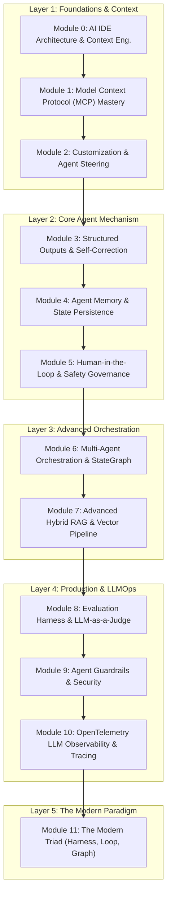

# 🎓 AI 에이전트 엔지니어링 실무 강의 계획서 (Curriculum)

본 문서는 **Google Antigravity IDE** 환경에서 진행되는 **AI 에이전트 시스템(Agentic Systems) 및 오케스트레이션 엔지니어링** 교육 과정의 공식 강의 계획서입니다. 수강생이 실무 환경에서 바로 활용할 수 있는 아키텍처 설계와 엔지니어링 구현 역량을 기르는 것을 목표로 합니다.

---

## 📌 1. 과정 개요 및 목표

* **교육 기간**: 6주 집중 과정 (주당 2개 모듈 또는 자기주도형 학습)
* **기반 환경**: Google Antigravity IDE, Python 3.11+, LangGraph, OpenTelemetry, FastMCP
* **교육 철학**:
  1. **원리 중심 (First Principles)**: 단순 라이브러리 API 호출을 넘어 내부 동작 메커니즘을 이해합니다.
  2. **실무 지향 (Production Reality)**: 비용(Token), 지연시간(Latency), 보안(가드레일), 장애 복원력(Circuit Breaker)을 항상 고려합니다.
  3. **1:1 실습 일치 (Hands-on Parity)**: 모든 이론 모듈은 동작하는 1:1 파이썬 예제 코드와 연결됩니다.

---

## 👥 2. 수강 대상 및 선수 지식 (Prerequisites)

### 🎯 수강 대상
* LLM API를 활용해 단순 챗봇을 만들어보았으나, 상태 관리와 자율 도구 실행을 갖춘 에이전트 구축이 필요한 소프트웨어 엔지니어
* 지식 기반 검색(RAG) 시스템의 정확도 개선 및 하이브리드 검색 파이프라인 구현을 고민하는 백엔드/데이터 엔지니어
* AI 에이전트의 보안 가드레일(프롬프트 주입 방어, PII 마스킹)과 분산 관측성(OpenTelemetry)을 도입하려는 엔지니어

### 📋 선수 지식 (권장)
* **Python 프로그래밍**: Python 3.10+ 문법 (타입 힌트, Pydantic, 비동기 `asyncio` 기초)
* **REST API & JSON**: 웹 통신 규격 및 구조화 데이터 처리 경험
* **기본 LLM 개념**: 프롬프트, 토큰, 컨텍스트 윈도우, Temperature에 대한 기본 이해

---

## 🏛️ 3. 본 과정의 5대 핵심 계층 (Layer 1 ~ Layer 5)

본 커리큘럼은 AI 에이전트 구축에 필요한 핵심 기술을 **5대 계층(Layer 1~5, 총 12개 모듈)**으로 나누어 단계별로 학습합니다.

---

## 🗓️ 4. 주차별 학습 로드맵 (6-Week Schedule)

| 주차 | 단계 및 계층 | 다루는 모듈 | 주차별 핵심 성과물 (Milestone) |
| :---: | :--- | :--- | :--- |
| **Week 1** | **Layer 1: Foundations** | Module 0, Module 1, Module 2 | • 프롬프트 캐싱 메커니즘을 통한 토큰 절감 시뮬레이터 • 로컬 도구/리소스를 연결하는 FastMCP 서버 구축 |
| **Week 2** | **Layer 2: Core Engine** | Module 3, Module 4, Module 5 | • Pydantic 자가 치유(Self-Healing) JSON 검증기 • 장단기 기억 저장소 및 위험 도구 승인(HITL) 인터셉터 |
| **Week 3** | **Layer 3-A: Multi-Agent** | Module 6 | • LangGraph 기반 기획자-작성자-검증자 협업 에이전트 파이프라인 |
| **Week 4** | **Layer 3-B: Advanced RAG** | Module 7 | • BM25+Dense 하이브리드 검색, RRF 순위 융합 및 리랭킹 파이프라인 |
| **Week 5** | **Layer 4: Ops & Security** | Module 8, Module 9, Module 10 | • 결정론적 검증과 LLM 판사를 결합한 3단계 채점 하네스 • 입·출력 2중 보안 가드레일 및 OpenTelemetry 분산 추적기 |
| **Week 6** | **Layer 5: Modern Triad** | Module 11 & 종합 캡스톤 | • 서킷 브레이커와 상태 롤백이 탑재된 최종 트라이어드 시스템 완성 |

---

## 📖 5. 모듈별 상세 학습 계획 (12개 모듈)

### 🔹 Layer 1: 기초 및 컨텍스트 엔지니어링 (Foundations)

#### [Module 0: AI IDE Architecture & Context Engineering](materials/00_context_engineering.md)
* **학습 목표**: AI IDE의 구조를 이해하고, 컨텍스트 윈도우 관리와 KV-Cache 프롬프트 캐싱 메커니즘의 원리를 파악한다.
* **실습 코드**: [`examples/00_context_engineering_example.py`](examples/00_context_engineering_example.py)
* **합격 기준**: 동일 프롬프트 접두사 캐싱 시뮬레이션을 통해 토큰 절감 및 응답 속도 개선 효과를 확인한다.

#### [Module 1: Model Context Protocol (MCP) Mastery](materials/01_mcp.md)
* **학습 목표**: 표준 도구 연결 규격인 MCP 아키텍처를 이해하고, FastMCP로 Tools, Resources, Prompts를 제공하는 서버를 제작한다.
* **실습 코드**: [`examples/01_mcp_server.py`](examples/01_mcp_server.py)
* **합격 기준**: FastMCP 서버를 구동하여 도구 호출, 시스템 리소스 조회, 템플릿 프롬프트 반환이 정상 동작함을 검증한다.

#### [Module 2: Customization & Agent Steering](materials/02_customization.md)
* **학습 목표**: 상시 전역 규칙(`AGENTS.md`)과 동적 로딩 스킬(`SKILL.md`)의 역할을 구분하고, 효율적인 에이전트 제어 구조를 설계한다.
* **실습 구성**: [`.agents/AGENTS.md`](.agents/AGENTS.md), [`.agents/skills/review-code/`](.agents/skills/review-code/)
* **합격 기준**: 시스템 프롬프트 비대화를 방지하면서 필요에 따라 적절한 온디맨드 스킬이 동적으로 로딩되는 구조를 확인한다.

---

### 🔹 Layer 2: 에이전트 핵심 메커니즘 (Core Agent Engine)

#### [Module 3: Structured Outputs & Self-Correction Loop](materials/03_structured_outputs.md)
* **학습 목표**: LLM 출력을 Pydantic v2 스키마로 검증하고, 파싱 실패 시 에러 피드백을 통해 스스로 수정하는 자가 치유(Self-Correction) 루프를 구현한다.
* **실습 코드**: [`examples/03_structured_outputs_example.py`](examples/03_structured_outputs_example.py)
* **합격 기준**: 유효하지 않은 JSON 응답이 발생했을 때 에러 피드백을 주입하여 지정된 횟수 내에 유효한 스키마로 복구됨을 확인한다.

#### [Module 4: Agent Memory & State Persistence](materials/04_agent_memory.md)
* **학습 목표**: 단기 메모리(Sliding Window/Summary), 장기 메모리(Key-Value/Vector)의 역할을 이해하고 상태 영속화 구조를 구현한다.
* **실습 코드**: [`examples/04_agent_memory_example.py`](examples/04_agent_memory_example.py)
* **합격 기준**: 대화 세션 간에 사용자의 선호도와 핵심 엔티티 정보를 추출·저장하고, 이후 질의에서 이를 참조하여 답변함을 확인한다.

#### [Module 5: Human-in-the-Loop & Safety Governance](materials/05_human_in_the_loop.md)
* **학습 목표**: 결제, 데이터베이스 수정 등 부작용이 큰 도구 실행 시 인터럽트(Breakpoint)를 걸고 사용자의 명시적 승인을 받는 제어 흐름을 구현한다.
* **실습 코드**: [`examples/05_hitl_example.py`](examples/05_hitl_example.py)
* **합격 기준**: 고위험 액션 실행 전 상태 머신이 일시 중지되고, 사용자 승인 입력이 들어와야 다음 단계로 진행됨을 검증한다.

---

### 🔹 Layer 3: 복합 오케스트레이션 및 데이터 파이프라인 (Advanced Systems)

#### [Module 6: Multi-Agent Orchestration & StateGraph](materials/06_multi_agent.md)
* **학습 목표**: Router, Supervisor-Worker, Handoff 패턴의 차이를 분석하고, LangGraph StateGraph 기반 다중 에이전트 협업 파이프라인을 구축한다.
* **실습 코드**: [`examples/06_orchestrator.py`](examples/06_orchestrator.py)
* **합격 기준**: 기획자 -> 작성자 -> 검증자로 이어지는 상태 전이와 조건부 분기가 안정적으로 동작함을 확인한다.

#### [Module 7: Advanced Hybrid RAG & Vector Pipeline](materials/07_rag_vector_db.md)
* **학습 목표**: 키워드 기반 검색(BM25)과 의미 기반 검색(Dense Vector)을 결합하고, RRF(Reciprocal Rank Fusion) 알고리즘과 리랭킹을 적용한 하이브리드 RAG를 구현한다.
* **실습 코드**: [`examples/07_rag_example.py`](examples/07_rag_example.py)
* **합격 기준**: RRF 순위 융합을 통해 키워드 일치 문서와 의미론적 연관 문서를 종합 채점하고, 상위 문서를 기반으로 질의에 정확히 답변함을 확인한다.

---

### 🔹 Layer 4: 안정성 검증 및 운영 (Production & Operations)

#### [Module 8: Evaluation Harness & LLM-as-a-Judge](materials/08_evaluation_harness.md)
* **학습 목표**: 프롬프트 수정 및 모델 변경 시 성능 저하를 방지하기 위해 결정론적 단언문과 LLM 판사를 결합한 다계층 평가 하네스를 설계한다.
* **실습 코드**: [`examples/08_eval_harness.py`](examples/08_eval_harness.py)
* **합격 기준**: 기본 형식 검증 실패 시 빠른 실패(Fail-Fast)로 비용을 절감하고, 통과 건에 대해서만 루브릭 기반 정성 평가를 수행함을 확인한다.

#### [Module 9: Agent Guardrails & Security](materials/09_guardrails_security.md)
* **학습 목표**: 프롬프트 인젝션 및 탈옥 시도를 감지하는 입력 가드레일과, 민감 정보(PII) 마스킹 및 카나리아 토큰 검사를 수행하는 출력 가드레일 2중 방어선을 구현한다.
* **실습 코드**: [`examples/09_guardrails_example.py`](examples/09_guardrails_example.py)
* **합격 기준**: 악의적 프롬프트 주입 차단과 출력 내 개인정보(전화번호/이메일) 자동 마스킹 처리가 정상 동작함을 검증한다.

#### [Module 10: OpenTelemetry LLM Observability & Tracing](materials/10_observability_tracing.md)
* **학습 목표**: OpenTelemetry 표준을 활용해 에이전트 실행 단계별 Trace와 Span을 계측하고, 지연시간 병목과 토큰 사용량을 추적한다.
* **실습 코드**: [`examples/10_observability_example.py`](examples/10_observability_example.py)
* **합격 기준**: 부모-자식 Span 계층 구조를 가진 실행 로그와 단계별 소요 시간 및 토큰 집계 결과를 출력함을 확인한다.

---

### 🔹 Layer 5: 통합 아키텍처 (The Modern Paradigm)

#### [Module 11: The Modern Agentic Triad (Harness, Loop, Graph)](materials/11_modern_agentic_triad.md)
* **학습 목표**: 현대 AI 에이전트 아키텍처의 3대 요소(평가 하네스, 자가 수정 루프, 상태 그래프)를 결합하고, 무한 루프 방지를 위한 서킷 브레이커와 상태 롤백을 구현한다.
* **실습 코드**: [`examples/11_triad_orchestrator.py`](examples/11_triad_orchestrator.py)
* **합격 기준**: 연속 오류 발생 시 서킷이 동작하여 안전 상태로 롤백되고, 정상 수정 시 평가 기준을 통과해 안정적으로 종료됨을 확인한다.

---

## 🏆 6. 수료 및 캡스톤 프로젝트 기준

본 과정을 완주한 수강생은 **"실제 도구 및 데이터와 연동되고, 서킷 브레이커, 관측성 추적, 다계층 평가 하네스를 갖춘 안정적인 자율 에이전트 파이프라인"**을 스스로 설계하고 구현할 수 있는 실무 역량을 갖추게 됩니다.
