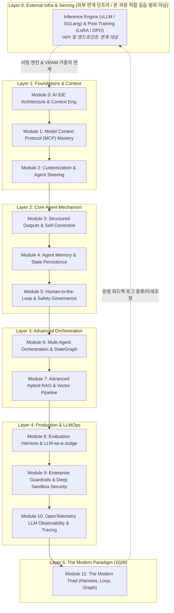

# 🎓 엔터프라이즈 에이전트 시스템 & LLMOps 오케스트레이션 실라버스 (Syllabus)

본 문서는 **Google Antigravity IDE** 환경에서 진행되는 **엔터프라이즈 에이전트 시스템(Agentic Systems) 및 LLMOps 오케스트레이션** 교육 과정의 공식 강의 계획서입니다. 수강생이 실무 프로덕션 환경에서 즉시 활용할 수 있는 아키텍처 설계와 엔지니어링 역량을 기르는 것을 목표로 합니다.

---

## 📌 1. 과정 개요 및 목표

* **교육 기간**: 6주 집중 과정 (주당 2개 모듈 또는 자기주도형 학습)
* **기반 환경**: Google Antigravity IDE, Python 3.11+, LangGraph, OpenTelemetry, FastMCP
* **교육 철학**:
  1. **원리 중심 (First Principles)**: 단순 라이브러리 API 호출을 넘어 내부 동작 메커니즘을 이해합니다.
  2. **프로덕션 현실성 (Production Reality)**: 비용(Token/VRAM), 지연시간(Latency), 보안(Zero-Trust Sandbox), 장애 복원력(Circuit Breaker)을 항상 고려합니다.
  3. **1:1 실습 일치 (Hands-on Parity)**: 모든 이론 모듈은 동작하는 1:1 파이썬 예제 코드와 연결됩니다.

---

## 👥 2. 수강 대상 및 선수 지식 (Prerequisites)

### 🎯 수강 대상
* LLM API를 활용해 단순 챗봇을 만들어보았으나, 프로덕션 수준의 자율 에이전트 구축에 한계를 느끼는 소프트웨어 엔지니어
* 사내 지식 기반 RAG 시스템의 정확도, 권한 관리(RBAC), 대규모 스케일링을 고민하는 백엔드/데이터 엔지니어
* AI 시스템의 보안 거버넌스(MicroVM 샌드박싱, Egress 차단)와 분산 관측성(OTel)을 도입하려는 MLOps/LLMOps 엔지니어

### 📋 선수 지식 (권장)
* **Python 프로그래밍**: Python 3.10+ 문법 (타입 힌트, Pydantic, 비동기 `asyncio` 기초)
* **REST API & JSON**: 웹 통신 규격 및 구조화 데이터 처리 경험
* **기본 LLM 개념**: 프롬프트, 토큰, 컨텍스트 윈도우, Temperature에 대한 기본 이해

---

## 🏛️ 3. 본 과정의 5대 핵심 계층 (Layer 1 ~ Layer 5) & 하부 연계 인프라

본 커리큘럼은 AI 시스템 전체 스택 중 **엔터프라이즈 에이전트 오케스트레이션 및 LLMOps(Layer 1~5, 총 12개 모듈)**을 집중적으로 교육합니다.  
하부 인프라(Layer 0)는 본 과정에서 직접 가중치를 학습하거나 서빙 클러스터를 구축하는 실습 대상이 아니며, 에이전트 시스템이 호출하고 운영 피드백을 전달하는 **'외부 연계 인프라(Upstream Infrastructure)'**로 명확히 위치를 정의합니다.

### ⚙️ Layer 0 (연계 인프라) 기술 배경 및 접점
* **서빙 엔진 (vLLM, TensorRT-LLM)**: PagedAttention, KV-Cache 양자화, Continuous Batching을 통한 고처리량(Throughput) 및 저지연 서빙.
* **포스트 트레이닝 플라이휠 (LoRA, DPO)**: 에이전트의 운영 피드백 로그를 수집하여 소형 특화 모델로 지식 증류(Distillation)하거나 파인튜닝하는 상위 연계 파이프라인.

---

## 🗓️ 4. 주차별 학습 로드맵 (6-Week Schedule)

| 주차 | 단계 및 계층 | 다루는 모듈 | 주차별 핵심 성과물 (Milestone) |
| :---: | :--- | :--- | :--- |
| **Week 1** | **Layer 1: Foundations** | Module 0, Module 1, Module 2 | • 프롬프트 캐싱을 통한 토큰 80% 절감 시뮬레이터 • 사내 도구/DB를 연결하는 FastMCP 서버 구축 |
| **Week 2** | **Layer 2: Core Engine** | Module 3, Module 4, Module 5 | • Pydantic 자가 치유(Self-Healing) JSON 검증기 • 장단기 기억 저장소 및 위험 도구 승인(HITL) 인터셉터 |
| **Week 3** | **Layer 3-A: Multi-Agent** | Module 6 | • LangGraph 기반 기획자-작성자-검증자 3인 에이전트 파이프라인 |
| **Week 4** | **Layer 3-B: Enterprise RAG** | Module 7 | • BM25+Dense 하이브리드 검색, RRF 순위 융합, 멀티테넌시 RBAC 격리 |
| **Week 5** | **Layer 4: Ops & Security** | Module 8, Module 9, Module 10 | • CI/CD 회귀 방지 3단계 채점 하네스 • MicroVM 샌드박스 격리 및 OpenTelemetry 분산 추적기 |
| **Week 6** | **Layer 5: Modern Triad** | Module 11 & 종합 캡스톤 | • 서킷 브레이커와 상태 롤백이 탑재된 최종 트라이어드 시스템 완성 |

---

## 📖 5. 모듈별 상세 학습 계획 (12개 모듈)

### 🔹 Layer 1: 기초 및 컨텍스트 엔지니어링 (Foundations)

#### [Module 0: AI IDE Architecture & Context Engineering](materials/00_context_engineering.md)
* **학습 목표**: AI IDE의 3대 계층 구조를 이해하고, 컨텍스트 윈도우 한계와 KV-Cache 프롬프트 캐싱 메커니즘을 마스터한다.
* **실습 코드**: [`examples/00_context_engineering_example.py`](examples/00_context_engineering_example.py)
* **합격 기준**: 동일 프롬프트 접두사 캐싱 시뮬레이션을 통해 80% 이상의 토큰 및 레이턴시 절감 수치를 입증할 것.

#### [Module 1: Model Context Protocol (MCP) Mastery](materials/01_mcp.md)
* **학습 목표**: Anthropic 오픈 표준인 MCP 아키텍처를 이해하고, FastMCP로 Tools, Resources, Prompts를 노출하는 표준 서버를 제작한다.
* **실습 코드**: [`examples/01_mcp_server.py`](examples/01_mcp_server.py)
* **합격 기준**: FastMCP 서버를 가동하여 로컬 환경에서 도구 호출, 시스템 통계 리소스 조회, 템플릿 프롬프트 반환을 정상 완료할 것.

#### [Module 2: Customization & Agent Steering](materials/02_customization.md)
* **학습 목표**: 상시 전역 규칙(`AGENTS.md`)과 동적 로딩 스킬(`SKILL.md`)의 차이를 이해하고, 2단계 도구 메타 검색 전략을 수립한다.
* **실습 구성**: [`.agents/AGENTS.md`](.agents/AGENTS.md), [`.agents/skills/review-code/`](.agents/skills/review-code/)
* **합격 기준**: 시스템 프롬프트 비대화(Bloat) 없이 상황에 따라 적절한 온디맨드 스킬이 동적으로 로딩되는 구조를 설계할 것.

---

### 🔹 Layer 2: 에이전트 핵심 메커니즘 (Core Agent Engine)

#### [Module 3: Structured Outputs & Self-Correction Loop](materials/03_structured_outputs.md)
* **학습 목표**: LLM의 비결정론적 출력을 Pydantic v2 스키마로 강제하고, 파싱 에러 발생 시 자가 치유(Self-Healing) 루프를 구현한다.
* **실습 코드**: [`examples/03_structured_outputs_example.py`](examples/03_structured_outputs_example.py)
* **합격 기준**: 의도적으로 결함 있는 JSON 응답을 주입했을 때, 에러 피드백을 전달하여 3회 이내에 스스로 수정된 유효 스키마를 반환할 것.

#### [Module 4: Agent Memory & State Persistence](materials/04_agent_memory.md)
* **학습 목표**: 단기 메모리(Sliding Window/Summary), 장기 메모리(KV/Vector), 핵심 엔티티 메모리의 차이를 이해하고 영속 저장소를 구축한다.
* **실습 코드**: [`examples/04_agent_memory_example.py`](examples/04_agent_memory_example.py)
* **합격 기준**: 다중 세션 간에 사용자의 선호도와 핵심 엔티티 정보를 추출하여 영구 저장하고 후속 질의에서 이를 재활용할 것.

#### [Module 5: Human-in-the-Loop & Safety Governance](materials/05_human_in_the_loop.md)
* **학습 목표**: 결제, 데이터베이스 삭제 등 Side-Effect가 큰 도구 실행 시 Breakpoint를 걸고 인간의 명시적 승인(Approval)을 받는 거버넌스를 구현한다.
* **실습 코드**: [`examples/05_hitl_example.py`](examples/05_hitl_example.py)
* **합격 기준**: 고위험 액션 감지 시 상태 머신이 즉시 중단(Interrupt)되고, 승인 신호 주입 전까지는 다음 노드로 전이되지 않음을 증명할 것.

---

### 🔹 Layer 3: 복합 에이전트 및 데이터 파이프라인 (Advanced Systems)

#### [Module 6: Multi-Agent Orchestration & StateGraph](materials/06_multi_agent.md)
* **학습 목표**: Router, Supervisor-Worker, Handoff Swarm 패턴을 비교 분석하고, LangGraph StateGraph 기반 다중 에이전트 협업 체계를 구축한다.
* **실습 코드**: [`examples/06_orchestrator.py`](examples/06_orchestrator.py)
* **합격 기준**: 기획자 -> 병렬 작성자(도구 격리) -> 품질 검증자의 상태 전이가 조건부 엣지(Conditional Edge)를 통해 안정적으로 동작할 것.

#### [Module 7: Advanced Hybrid RAG & Vector Pipeline](materials/07_rag_vector_db.md)
* **학습 목표**: Dense(임베딩)+Sparse(BM25) 하이브리드 검색과 RRF 순위 융합, 멀티테넌시 RBAC 격리, 수억 건 HNSW 인덱싱, 실시간 캐시 무효화를 체득한다.
* **실습 코드**: [`examples/07_rag_example.py`](examples/07_rag_example.py)
* **합격 기준**: RRF 수식을 적용해 키워드 일치 문서와 의미적 맥락 문서를 결합 채점하고, 상위 문서를 Re-ranking하여 사실 기반 응답을 생성할 것.

---

### 🔹 Layer 4: 프로덕션 운영 및 LLMOps (Production & Operations)

#### [Module 8: Evaluation Harness & LLM-as-a-Judge](materials/08_evaluation_harness.md)
* **학습 목표**: CI/CD 파이프라인에서 프롬프트 회귀(Regression)를 방지하는 3단계 다계층 자동화 채점 하네스를 설계한다.
* **실습 코드**: [`examples/08_eval_harness.py`](examples/08_eval_harness.py)
* **합격 기준**: 비용 $0의 결정론적 검증 실패 시 LLM 판사 호출을 즉시 차단(Short-circuit)하고, 통과 건에 대해서만 1~5점 루브릭 채점을 수행할 것.

#### [Module 9: Enterprise Guardrails & Deep Sandbox Security](materials/09_guardrails_security.md)
* **학습 목표**: Input/Output 2중 보안 게이트, Firecracker/gVisor MicroVM 커널 격리, 제로-트러스트 네트워크 Egress 차단, 간접 인젝션 방어책을 구현한다.
* **실습 코드**: [`examples/09_guardrails_example.py`](examples/09_guardrails_example.py)
* **합격 기준**: 탈옥 입력 차단, 출력 내 개인정보(전화번호/이메일) 실시간 마스킹, 카나리아 토큰을 통한 시스템 프롬프트 유출 방어가 동작할 것.

#### [Module 10: OpenTelemetry LLM Observability & Tracing](materials/10_observability_tracing.md)
* **학습 목표**: 분산 환경에서 Trace ID와 Span 계층 구조를 계측하여 에이전트 단계별 지연시간 병목과 토큰 비용을 시각화한다.
* **실습 코드**: [`examples/10_observability_example.py`](examples/10_observability_example.py)
* **합격 기준**: 부모-자식 Span 관계가 유지되는 워터폴(Waterfall) 실행 로그와 단계별 토큰 집계 메트릭을 출력할 것.

---

### 🔹 Layer 5: 차세대 통합 패러다임 (The Modern Paradigm)

#### [Module 11: The Modern Agentic Triad (Harness, Loop, Graph)](materials/11_modern_agentic_triad.md)
* **학습 목표**: 2026 현대 AI 엔지니어링의 3대 기둥(하네스, 루프, 그래프)의 유기적 결합을 마스터하고, 루프 무한 진동 방지용 서킷 브레이커와 상태 롤백을 구현한다.
* **실습 코드**: [`examples/11_triad_orchestrator.py`](examples/11_triad_orchestrator.py)
* **합격 기준**: 연속 실패 시 서킷이 OPEN되어 안전 스냅샷으로 롤백되고, 자가 치유 완료 시 하네스 100점 통과로 정상 종료되는 통합 상태 머신을 완성할 것.

---

## 🏆 6. 수료 및 캡스톤 프로젝트 기준

본 과정을 완주한 수강생은 **"실제 사내 데이터베이스 및 외부 API와 연동되고, 서킷 브레이커와 OTel 추적, 3단계 평가 하네스를 통과하는 엔터프라이즈 자율 에이전트"**를 단독으로 설계하고 프로덕션에 배포할 수 있는 역량을 증명하게 됩니다.
