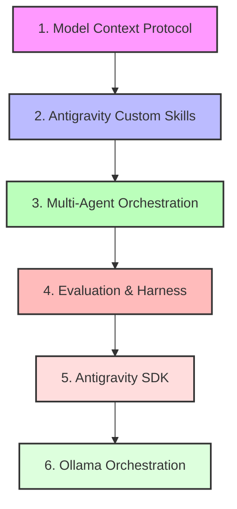

# 🚀 Antigravity와 함께하는 AI 엔지니어링 마스터 클래스

본 교육 과정은 **Antigravity IDE** 환경에서 최근 AI 엔지니어링의 핵심 트렌드인 **Model Context Protocol (MCP)**, **커스텀 에이전트 스킬**, **멀티 에이전트 오케스트레이션**, **평가 하네스(Evaluation Harness)**, **Antigravity SDK**, 그리고 **로컬 LLM (Ollama) 멀티 에이전트 협업**을 실습하며 마스터할 수 있도록 설계된 종합 커리큘럼입니다.

이 워크스페이스는 학습 자료와 이론, 그리고 바로 실행하고 테스트해 볼 수 있는 코드 예제들로 구성되어 있습니다.

---

## 📅 커리큘럼 로드맵



### [Module 1: Model Context Protocol (MCP)](file:///c:/Coding/AI-Engineering/materials/01_mcp.md)
*   **이론**: AI 모델이 외부 도구, 데이터베이스, API 등과 소통하는 오픈 표준 프로토콜(MCP)의 개념과 아키텍처(Host vs. Server) 이해.
*   **실습**: Python `fastmcp` 패키지를 사용해 간단한 시스템 성능 메트릭 및 날씨 정보를 제공하는 [mcp_server.py](file:///c:/Coding/AI-Engineering/examples/mcp_server.py) 개발 및 호스트 등록 실습.

### [Module 2: Customization System & Slash Commands](file:///c:/Coding/AI-Engineering/materials/02_skills.md)
*   **이론**: 에이전트의 상시 전역 규칙(`AGENTS.md`), 동적 커스텀 스킬(`SKILL.md`), 그리고 4대 생산성 슬래시 명령어(`/goal`, `/schedule`, `/grill-me`, `/learn`)를 활용한 완벽한 에이전트 행동 통제 구조 이해.
*   **실습**: 프로젝트 전역 규칙 파일([.agents/AGENTS.md](file:///c:/Coding/AI-Engineering/.agents/AGENTS.md)) 작성, 코드 리뷰어 스킬([SKILL.md](file:///c:/Coding/AI-Engineering/.agents/skills/review-code/SKILL.md)) 연동, 및 대화형 조율(`/grill-me`) 검증.

### [Module 3: Multi-Agent Orchestration](file:///c:/Coding/AI-Engineering/materials/03_orchestration.md)
*   **이론**: 복잡한 소프트웨어 문제를 해결하기 위해 여러 하위 에이전트를 생성, 라우팅, 오케스트레이션하는 주류 아키텍처 패턴.
*   **실습**: Master 에이전트가 Outline 에이전트와 Content 작성 에이전트를 소환해 글을 연계 작성하도록 조율하는 [orchestrator.py](file:///c:/Coding/AI-Engineering/examples/orchestrator/orchestrator.py) 구현.

### [Module 4: Evaluation & Harness](file:///c:/Coding/AI-Engineering/materials/04_harness.md)
*   **이론**: AI 애플리케이션의 신뢰성을 담보하기 위한 정량 평가, 프롬프트 회귀 테스트 및 LLM-as-a-Judge 개요.
*   **실습**: 어설션 검증 기법을 구현하여 프롬프트 결과물들의 응답 품질을 등급별로 자동 평가하는 [eval_harness.py](file:///c:/Coding/AI-Engineering/examples/harness/eval_harness.py) 구동.

### [Module 5: Antigravity SDK Mastery](file:///c:/Coding/AI-Engineering/materials/05_antigravity_sdk.md)
*   **이론**: Antigravity 2.0 플랫폼의 백엔드 실행 런타임을 Python 코드로 직접 호출하여 자동화 에이전트 루프를 구현하는 방법.
*   **실습**: `google-antigravity` 라이브러리를 이용하여 로컬 파일을 읽고 분석하여 작업을 처리하는 자율 에이전트 스크립트 [sdk_agent.py](file:///c:/Coding/AI-Engineering/examples/sdk_agent.py) 작성 및 검증.

### [Module 6: Ollama Local Agent Collaboration](file:///c:/Coding/AI-Engineering/materials/06_ollama_orchestration.md)
*   **이론**: 로컬 LLM 환경(Ollama)에 탑재된 `qwen2.5-coder` 모델을 사용하여 코드 빌더(Coder)와 검증기(Validator) 간의 피드백 기반 협업 조율 설계.
*   **실습**: 공식 `ollama` SDK를 기반으로 두 에이전트가 코딩 과제를 완성하기 위해 상호 작용하는 [ollama_orchestrator.py](file:///c:/Coding/AI-Engineering/examples/ollama_orchestrator.py) 예제 실행.

---

## 📂 폴더 구조 안내

```
c:\Coding\AI-Engineering\
├── curriculum.md                <-- 현재 문서 (Syllabus)
├── materials/                   <-- 상세 이론 학습 교재 폴더
│   ├── 01_mcp.md
│   ├── 02_skills.md
│   ├── 03_orchestration.md
│   ├── 04_harness.md
│   ├── 05_antigravity_sdk.md
│   └── 06_ollama_orchestration.md
├── examples/                    <-- 직접 돌려보는 실습 코드 폴더
│   ├── mcp_server.py
│   ├── sdk_agent.py
│   ├── ollama_orchestrator.py
│   ├── orchestrator/
│   │   └── orchestrator.py
│   └── harness/
│       └── eval_harness.py
└── .agents/
    └── skills/
        └── review-code/
            └── SKILL.md         <-- 실습용 Antigravity 커스텀 스킬
```

---

## 🛠️ 준비 사항

학습에 필요한 Python 가상환경 및 라이브러리 설치는 에이전트 오케스트레이션 단계를 통해 이미 완료되었습니다!
추가적인 실습 구동 명령은 각 모듈 교재의 **실습 단계**를 참조해 주세요.

즐겁고 보람찬 AI 엔지니어링 학습이 되기를 바랍니다! 🚀
