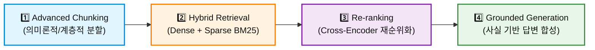
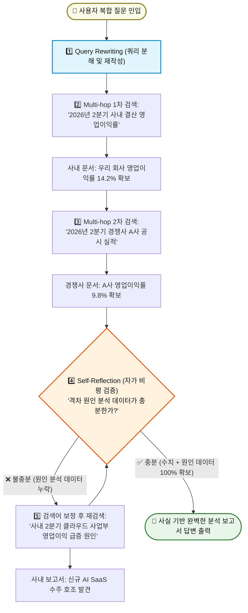
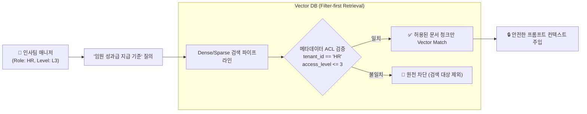

# 📚 Module 7: Advanced Hybrid RAG & Vector Pipeline

**RAG (Retrieval-Augmented Generation)**는 LLM이 최신 사내 지식이나 문서를 검색하여 환각(Hallucination) 없이 사실 기반 답변을 생성하도록 돕는 필수 아키텍처입니다. 본 단원에서는 단순 벡터 검색을 넘어 **하이브리드 검색(Hybrid Search)**과 **Re-ranking**, **Agentic RAG**를 다룹니다.

---

## 🏛️ 1. 고성능 RAG 파이프라인 4단계



| 단계 | 핵심 기술 | 해결하는 문제 및 역할 |
| :--- | :--- | :--- |
| **1. Advanced Chunking** | Semantic Chunking, Parent-Child 계층 분할 | 고정 길이 자르기로 인한 문맥 단절 방지 |
| **2. Hybrid Retrieval** | Dense(임베딩 벡터) + Sparse(BM25) | 고유명사/코드 검색과 의미적 맥락 검색 결합 |
| **3. Re-ranking** | Cross-Encoder, RRF 순위 융합 | 1차 검색(Top-20) 중 가장 핵심적인 Top-3만 선별 |
| **4. Grounded Generation** | 인용 기반 시스템 프롬프트 합성 | 검색된 문서만을 근거로 삼아 환각(Hallucination) 차단 |

1. **Advanced Chunking**: 고정 길이 분할 대신 의미론적 문단 경계(Semantic Chunking) 또는 부모-자식(Parent-Child) 계층 청킹 적용.
2. **Hybrid Retrieval**: 의미적 맥락을 찾는 **Dense Search (임베딩 벡터)**와 고유명사/코드명을 정확히 찾는 **Sparse Search (BM25)**를 결합.
3. **RRF (Reciprocal Rank Fusion)**: 두 검색 결과의 순위를 수학적으로 병합하여 최적의 검색 점수 산출:
   $$RRF\_Score(d) = \sum_{m \in M} \frac{1}{k + r_m(d)}$$
4. **Cross-Encoder Re-ranking**: 1차 검색된 Top-20개 문서를 정밀한 Re-ranker 모델로 재평가하여 최상위 Top-3만 최종 프롬프트에 주입.

---

## 🤖 2. 에이전틱 RAG (Agentic RAG)

과거의 **전통적 RAG(Naive RAG)**는 사용자의 질문을 그대로 검색기에 1번 던지고, 결과가 좋든 나쁘든 무조건 답변을 뱉는 '일방통행'이었습니다.  
반면 **에이전틱 RAG(Agentic RAG)**는 LLM이 검색기(`retriever_tool`)를 도구로 쥐고, **스스로 생각하고 되물으며 3대 지능형 판단**을 내립니다:

* **Query Rewriting (질문 재작성)**: 사용자의 모호한 구어체 질문을 검색에 최적화된 키워드로 분해/재작성.
* **Multi-hop Search (다단계 연쇄 검색)**: 복합적인 질문을 해결하기 위해 1차 검색 결과를 단서 삼아 2차, 3차 꼬리물기 검색 수행.
* **Self-Reflection (자가 비평 & 재검색)**: 검색된 문서로 완벽한 답변이 가능한지 스스로 검증하고, 부족하면 검색어를 바꿔 다시 검색(Feedback Loop).

---

### 💡 실전 시나리오: 복합 기업 분석 질문 해결 과정

사용자가 다음과 같이 복합적인 질문을 던졌을 때 에이전틱 RAG가 동작하는 실제 흐름입니다:

> 💬 **사용자 질문**: *"이번 분기 우리 회사와 경쟁사 A사의 영업이익률 격차랑, 우리 회사가 앞선 핵심 요인을 분석해줘."*



#### 🔍 단계별 작동 상세:
1. **Query Rewriting (질문 쪼개기)**:
   * 복합 질문을 보고 한 번에 검색하지 않고, `사내 실적 쿼리`와 `경쟁사 실적 쿼리` 2개로 지능적으로 분해합니다.
2. **Multi-hop Search (꼬리물기 검색)**:
   * 1차 검색에서 "우리 회사 14.2%"를 알아내고, 2차 검색에서 "경쟁사 9.8%"를 확보하여 **4.4%p 격차**를 스스로 계산합니다.
3. **Self-Reflection (답변 충분성 자체 검증)**:
   * 에이전트가 생각합니다: *"격차(4.4%p)는 구했는데, 사용자가 물어본 '우리가 앞선 핵심 원인'에 대한 근거 문서가 없네? 이대로 답하면 환각(소설)을 쓰게 된다!"*
   * ➔ **답변 생성을 중단하고, 사내 사업부 실적 보고서로 3차 타겟 재검색을 스스로 수행**합니다.
4. **Grounded Generation (최종 답변)**:
   * 모든 단서가 완벽히 모였을 때만 최종 보고서를 사용자에게 출력합니다.

---

## 🏢 3. 엔터프라이즈 멀티테넌시 보안 & RBAC 메타데이터 격리

단일 테넌트 토이 프로젝트와 달리, 수만 명의 임직원이 사용하는 사내 RAG 시스템에서는 **권한이 없는 정보의 검색 유출(Information Leakage)**이 가장 치명적인 보안 사고입니다.



### Pre-filtering vs Post-filtering 트레이드오프
* **Pre-filtering (선제적 필터링, 강력 권장)**: 벡터 검색을 수행하기 전에 메타데이터 색인(B-Tree/Inverted Index)을 통해 사용자가 접근 가능한 문서 ID 집합으로 검색 풀을 먼저 좁힌 후 ANN(근사 최근접 이웃) 검색을 수행합니다. 데이터 유출이 원천 차단됩니다.
* **Post-filtering (사후 필터링)**: 전체 벡터 중 Top-K를 먼저 뽑은 뒤 권한 없는 문서를 버리는 방식입니다. 상위 K개 문서가 전부 권한 밖의 문서인 경우 최종 검색 결과가 0개가 되는 치명적 결함(Recall Collapse)이 발생하므로 엔터프라이즈 환경에서는 금기시됩니다.

---

## ⚡ 4. 수억 건 규모의 대규모 벡터 인덱싱 (Scale-Out Indexing)

문서가 수천만 건을 넘어서면 모든 벡터를 VRAM이나 RAM에 올려두는 것은 천문학적인 클라우드 비용을 유발합니다.

| 기술 요소 | 동작 원리 | 적합한 엔터프라이즈 환경 | 트레이드오프 |
| :--- | :--- | :--- | :--- |
| **HNSW ($M, ef$)** | 계층적 작은 세상 그래프(Graph-based) 탐색 | 실시간성 최우선, 초당 수천 QPS 시스템 | RAM 소모량이 매우 큼 (벡터당 오버헤드 1.5~2배) |
| **DiskANN (Vamana)** | SSD 디스크 기반 압축 그래프 탐색 | 1억 건 이상의 대규모 데이터, 인프라 비용 절감 | RAM 소모량 80% 절감, 디스크 I/O로 인한 약간의 지연 |
| **PQ / SQ8 양자화** | 32비트 부동소수점 벡터를 8비트/4비트로 압축 | 고밀도 클러스터링 및 대용량 캐싱 | 메모리 75% 절감, 재현율(Recall) 1~3% 미세 손실 |

* **실무 권장 파라미터 (HNSW 기준)**:
  * `M = 16 ~ 32`: 노드당 연결할 최대 간선 수 (높을수록 재현율 증가, 인덱스 생성 시간/RAM 증가)
  * `efConstruction = 128 ~ 256`: 인덱스 빌드 시 탐색 깊이
  * `efSearch = 64 ~ 128`: 런타임 쿼리 시 탐색 깊이 (지연시간과 정확도 조절 레버)

---

## 🔄 5. 데이터 수명 주기: 실시간 캐시 무효화 & 임베딩 드리프트 완화

엔터프라이즈 지식 베이스는 정적이지 않고 매초 수정/삭제됩니다.

1. **실시간 캐시 무효화 (Cache Invalidation & CDC)**:
   * 사내 Confluence, Notion, 구글 드라이브 문서가 수정되면 **CDC(Change Data Capture, e.g. Debezium, Webhook)** 이벤트가 발행되어 즉시 해당 문서의 모든 청크를 벡터 DB에서 삭제하고 재청킹/재임베딩합니다.
   * LLM의 **프롬프트 캐시(Prompt Cache)** 역시 문서 해시(Hash)가 변경되는 즉시 무효화(Purge)되어야 최신 정보가 반영됩니다.
2. **임베딩 드리프트(Embedding Drift)와 듀얼 라이팅(Dual-Writing)**:
   * 더 뛰어난 임베딩 모델(예: `text-embedding-3-large`에서 차세대 모델)로 업그레이드할 때, 전체 데이터베이스를 즉시 교체하는 것은 시스템 중단을 유발합니다.
   * **Shadow Indexing & Dual-Write**: 신규 문서는 기존 인덱스와 신규 인덱스 양쪽에 모두 기록하고, 백그라운드 워커가 레거시 벡터를 점진적 변환한 뒤 라우터 스위칭으로 무중단 컷오버(Zero-downtime Cutover)를 수행합니다.

---

## 🏋️ 실습 예제 따라하기

이 모듈과 연계되는 파이썬 실습 코드 파일은 [examples/07_rag_example.py](file:///c:/Coding/AI-Engineering/examples/07_rag_example.py)에 작성되어 있습니다.

```bash
python examples/07_rag_example.py
```

