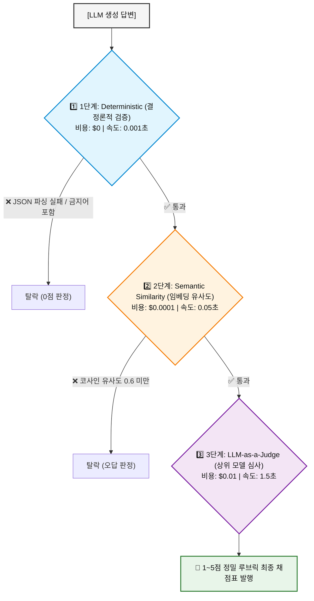

# 🧪 Module 8: Evaluation Harness & LLM-as-a-Judge

AI 엔지니어링에서 가장 위험하고 흔한 실수는 **"프롬프트 조금 고치고 눈으로 대화 2~3번 해본 뒤, '잘 돌아가네' 하고 배포하는 것"**입니다.  
이 페이지는 **"AI의 품질과 안전성을 인간의 '감(Feeling)'이 아니라 소프트웨어처럼 '기계적 시험장(Evaluation Harness)'을 통해 100% 숫자로 통제하는 법"**을 다룹니다.

---

## 🚗 1. "평가 하네스(Evaluation Harness)"란 도대체 무엇인가?

### 1) 어원과 직관적 비유
* **현실의 테스트 하네스**: 신차를 개발할 때 도로에 바로 내보내지 않고, 연구실 안의 **"롤러 거치대(Test Harness)"**에 차를 묶어두고 가속도, 브레이크, 매연 센서를 수백 개 붙여 극한으로 돌려보는 계측 장치를 뜻합니다.
* **AI 엔지니어링에서의 평가 하네스**:
  * AI 모델이나 프롬프트에게 **"수백 개의 기출문제(Test Dataset)를 자동으로 먹이고, 채점 기준에 따라 점수를 매긴 뒤, 종합 성적표를 출력하는 '자동 채점 시험장 프로그램'"**을 의미합니다.

### 2) 왜 일반 단위 테스트(`assert`)로는 AI를 검사할 수 없을까요?
일반 프로그래밍은 출력이 100% 정해져 있습니다:
```python
assert add(1, 2) == 3  # 무조건 3이 나와야 합격
```
하지만 LLM은 **확률적이고 비결정적(Non-deterministic)**입니다:
* 질문: *"FastMCP란 무엇인가?"*
* 어제의 답변: *"FastMCP는 데코레이터 기반의 Python 도구 제작 라이브러리입니다."*
* 오늘의 답변: *"파이썬 함수를 손쉽게 MCP 프로토콜로 변환해 주는 프레임워크입니다."*
* ➔ 문장이 매번 바뀌므로 단순 글자 일치(`==`)로는 테스트가 불가능합니다.  
  따라서 **"의미적 유사도"**와 **"엄격한 채점 루브릭(Rubric)"**을 갖춘 전용 평가 기계(Harness)가 필요한 것입니다.

---

## 🕳️ 2. 가장 무서운 적: "프롬프트 회귀 (Prompt Regression)"

소프트웨어 개발에서 버그를 고치면 다른 곳이 터지는 것처럼, AI에서도 **"두더지 잡기 현상(Regression)"**이 매일 일어납니다:

```text
[프롬프트 수정 전]
  • 기능 A (요약) : 95점 (매우 잘함)
  • 기능 B (JSON 포맷) : 40점 (에러 잦음) ──► "프롬프트에 JSON 규칙 3줄 추가해야지!"

[프롬프트 수정 후]
  • 기능 B (JSON 포맷) : 95점 (고쳐짐!)
  • 기능 A (요약) : 30점 (폭망! 🚨 JSON 신경 쓰느라 본문 요약 능력이 망가짐)
```

개발자는 기능 B만 확인하고 배포했다가 서비스 전체가 마비됩니다.  
**평가 하네스(Evaluation Harness)는 프롬프트를 단 한 줄이라도 고쳤을 때, 100개의 기존 테스트 케이스를 3초 만에 전수 검사하여 전체 합격률(Pass Rate)이 떨어지지 않았는지 증명해 주는 안전벨트**입니다.

---

## 📐 3. 비용과 정확도를 모두 잡는 3단계 다계층 평가 구조

모든 평가를 비싼 GPT-4o에게 시키면 테스트 비용만 수백만 원이 듭니다.  
따라서 실무에서는 **"가장 가볍고 저렴한 검사부터 거치는 3단계 깔때기"**를 구축합니다:



| 계층 | 평가 방식 | 무엇을 검사하는가? | 비용 및 속도 |
| :--- | :--- | :--- | :--- |
| **1️⃣ Deterministic<br/>(결정론적 검사)** | Python 코드, 정규식, Pydantic | JSON 문법 오류 여부, 필수 키 누락, 답변 길이, 비속어 포함 여부 | **비용 $0**<br>(0.001초) |
| **2️⃣ Semantic Similarity<br/>(의미론적 유사도)** | Embedding 모델 코사인 유사도 | 모범 답안(Ground Truth)과 의미가 얼마나 일치하는가 (0.0~1.0) | **초저비용**<br>(0.05초) |
| **3️⃣ LLM-as-a-Judge<br/>(판사 모델 채점)** | 최고 지능 모델(GPT-4o 등) 정성 평가 | 논리적 결함, 근거 문서 기반 사실성(Faithfulness), 환각 여부 1~5점 채점 | **고비용/고정밀**<br>(1~2초) |

---

## ⚖️ 4. LLM-as-a-Judge 정량 루브릭 (Rubric) 설계

LLM 판사에게 *"이 답변 잘 썼어?"*라고 두루뭉술하게 물어보면 판사조차 기분에 따라 점수를 바꿉니다.  
실무에서는 **인간 대학교수가 채점 기준표를 짜듯 엄격한 '루브릭(Rubric)'을 프롬프트에 주입**합니다:

| 점수 | 판정 기준 (Rubric) | 조치 |
| :--- | :--- | :--- |
| **5점 (Exceptional)** | 제공된 Context의 사실만을 100% 인용하며, 논리적 결함이나 불필요한 사족이 없음 | **즉시 배포 승인** |
| **3점 (Moderate)** | 대체로 맞으나 사소한 환각이 섞여 있거나 필수 요구 항목 중 일부가 누락됨 | **경고 및 재검토 필요** |
| **1점 (Failed)** | 명백한 허위 사실(Hallucination)을 생성하거나 지시사항을 정면으로 위반함 | **배포 차단 (Merge Rejection)** |

---

## 🔁 5. CI/CD 파이프라인 통합 (GitHub Actions 연동)

이 평가 하네스는 개발자의 로컬 컴퓨터에서만 도는 것이 아닙니다:
1. 개발자가 프롬프트나 코드를 수정하고 **Git PR(Pull Request)**을 올립니다.
2. **GitHub Actions(CI 서버)**가 백그라운드에서 `python examples/08_eval_harness.py`를 자동 실행합니다.
3. 시험 결과:
   * **합격 기준**: 전체 100개 테스트 중 **Pass Rate 90% 이상** AND **평균 점수 4.2점 이상**.
   * 기준 미달 시 Git의 **'Merge(병합)' 버튼이 빨간색으로 비활성화**되어 프로덕션 장애를 원천 차단합니다.

---

## 🏋️ 실습 예제 따라하기

이 모듈과 연계되는 파이썬 실습 코드 파일은 [examples/08_eval_harness.py](file:///c:/Coding/AI-Engineering/examples/08_eval_harness.py)에 작성되어 있습니다.

```bash
python examples/08_eval_harness.py
```
