# 👁️ Module 10: OpenTelemetry LLM Observability & Tracing

사용자 질문 하나에 수십 번의 프롬프트 호출, RAG 검색, 도구 실행, 멀티 에이전트 협업이 거미줄처럼 얽혀 돌아가는 현대 AI 시스템에서, **단순한 `print()`나 텍스트 로그는 완전히 무용지물**입니다.  
이 페이지는 **"복잡한 에이전트 시스템의 내부를 투시경처럼 들여다보며, 병목(지연시간)과 토큰 비용 누수를 밀리초 단위로 역추적하는 분산 관측 가능성(Distributed Observability)"**을 다룹니다.

---

## 🔍 1. 왜 전통적인 로그(`logging`)로는 AI를 관제할 수 없을까요?

### 1) 블랙박스 AI 시스템의 비극
* 일반 웹 서버는 `사용자 요청 ➔ DB 쿼리 ➔ 응답`이라는 일직선 흐름이므로 단일 로그 파일로 추적이 가능합니다.
* 하지만 우리가 6장에서 만든 **멀티 에이전트 StateGraph 시스템**은:
  * 1번 질문에 대해 4명의 워커가 비동기 병렬로 뛰고,
  * 중간에 검증자가 코드를 반려하여 2번 유턴(루프)을 돌고,
  * RAG 검색 도구를 3번 호출합니다.
* ➔ **결과**: "답변 나오는 데 8초 걸렸고 0.05달러 썼음"이라는 결과만 보고는, **"도대체 4명의 에이전트 중 누가 시간을 끌었고, 어느 도구에서 토큰이 샜는지"를 전혀 알 수가 없습니다!**

### 2) 해결책: "분산 추적 (Distributed Tracing)"
* 사용자 요청이 인입되는 순간 고유한 주민등록번호인 **`Trace ID`**를 발급합니다.
* 이 Trace ID가 수십 개의 에이전트, 함수, 비동기 스레드, 외부 API를 타고 흐르면서 **모든 단계를 하나의 거대한 계층 트리(Waterfall Tree)로 엮어 시각화**합니다.

---

## 🌲 2. Trace (트레이스)와 Span (스팬)의 계층 구조

OpenTelemetry(OTel) 표준에서 정의하는 추적의 핵심 단위입니다:

```mermaid
gantt
    title 에이전트 전체 파이프라인 분산 추적 폭포수 (Trace Waterfall)
    dateFormat  X
    axisFormat %s ms

    section 전체 Trace
    User Request (Trace Total 1,600ms / $0.008) :active, 0, 1600

    section 1단계: 보안
    Input Guardrail Scan (15ms)                :crit, 10, 25

    section 2단계: RAG
    Hybrid Search Span (220ms)                 :done, 30, 250
    BM25 Keyword Sub-span (30ms)               :active, 40, 70
    Dense Vector Sub-span (180ms)              :active, 50, 230

    section 3단계: 멀티에이전트
    Supervisor Planning (350ms)                :done, 260, 610
    Parallel Worker #1 집필 (420ms)            :active, 620, 1040
    Parallel Worker #2 집필 (480ms)            :active, 620, 1100

    section 4단계: 검증 및 수정
    Validator Review & Reject (300ms)          :crit, 1110, 1410
    Pinpoint Self-Healing Retry (150ms)        :done, 1420, 1570

    section 5단계: 출력
    Output PII Masking (20ms)                  :done, 1575, 1595
```



### 1) Trace (트레이스)
* 사용자가 질문을 던진 순간부터 최종 화면에 글자가 찍힐 때까지의 **"전체 생애주기 여정"** (나무의 뿌리).
* 고유의 `trace_id` (예: `tr-9f8a12bc78`)를 가집니다.

### 2) Span (스팬)
* 여정 안에서 일어난 **"개별 작업 마디 하나하나"** (나무의 가지).
* 각 Span은 다음의 **메타데이터(Attributes)**를 필수적으로 기록합니다:
  ```json
  {
    "span_name": "SectionWriterWorker_Generation",
    "parent_span_id": "supervisor_fanout",
    "duration_ms": 480.2,
    "attributes": {
      "llm.model": "gpt-4o",
      "llm.prompt_tokens": 1250,
      "llm.completion_tokens": 340,
      "llm.total_cost_usd": 0.0042,
      "llm.temperature": 0.2,
      "tool.call_count": 2
    }
  }
  ```

---

## 📊 3. LLM 관측 가능성 4대 골든 시그널 (Golden Signals)

프로덕션 운영팀이 대시보드에서 24시간 감시해야 하는 핵심 지표입니다:

| 지표 (Metric) | 설명 및 모니터링 목적 | 엔지니어링 조치 기준 |
| :--- | :--- | :--- |
| **1️⃣ Latency (지연시간)** | **TTFT (Time to First Token)**: 첫 글자 뜨는 시간<br>**E2E Duration**: 전체 작업 완료 시간 | TTFT > 1.5초 이상 지연 시 프롬프트 다이어트 또는 스트리밍 적용 |
| **2️⃣ Token Cost (비용 누수)** | 모델별/에이전트별 토큰 소비량 및 실제 달러($) 비용 집계 | 특정 에이전트가 전체 비용의 80%를 독점할 때 캐싱(KV-Cache) 도입 |
| **3️⃣ Tool & Step Errors** | 도구 호출 시 JSON 문법 에러, API 타임아웃, 재시도 횟수 | Tool Error Rate > 5% 초과 시 Pydantic 스키마 가드레일 보강 |
| **4️⃣ Quality & Drift (품질)** | 사용자 피드백(좋아요/싫어요), LLM-as-a-Judge 채점 추이 | 주간 평균 평가 점수가 4.0점 미만으로 하락 시 프롬프트 롤백 |

---

## 🛠️ 4. 엔터프라이즈 AI 관측 플랫폼 생태계 (2026)

실무에서는 직접 계측 코드를 짜지 않고, OpenTelemetry 표준을 지원하는 전용 대시보드를 연동합니다:

```text
┌──────────────────────────────────────────────────────────────────────────┐
│              대표적인 오픈소스 및 엔터프라이즈 LLM 관측 플랫폼                │
├───────────────────┬───────────────────┬──────────────────────────────────┤
│ 1. Langfuse       │ 2. Arize Phoenix  │ 3. Braintrust / LangSmith        │
├───────────────────┼───────────────────┼──────────────────────────────────┤
│ • 사실상 오픈소스 표준│ • RAG 검색 및 임베딩  │ • 대규모 엔터프라이즈 기업용      │
│ • Docker 자체 호스팅  │   클러스터 시각화     │ • 프롬프트 버전 관리와           │
│ • 완벽한 비용/트레이스│ • 환각(Drift) 심층     │   CI/CD 자동 채점 연동           │
│   대시보드 제공       │   분석에 특화         │                                  │
└───────────────────┴───────────────────┴──────────────────────────────────┘
```

---

## 🏋️ 실습 예제 따라하기

이 모듈과 연계되는 파이썬 실습 코드 파일은 [examples/10_observability_example.py](file:///c:/Coding/AI-Engineering/examples/10_observability_example.py)에 작성되어 있습니다.

```bash
python examples/10_observability_example.py
```

### 핵심 실습 포인트
1. 전체 Trace 안에 `Input_Guardrail ➔ RAG_Search ➔ Agent_Execution ➔ Output_Sanitize` 4개의 계층적 Span이 어떻게 생성되는지 확인.
2. 각 Span마다 소요된 **실제 지연시간(ms)**과 소모된 **토큰 비용($)**이 어떻게 합산되는지 관측성 리포트 확인.
