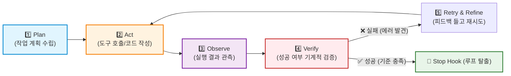

# 🌐 Module 11: The Modern Agentic Triad — Harness, Loop, & Graph Engineering

2024년까지의 AI 개발이 프롬프트를 예쁘게 다듬는 **프롬프트 엔지니어링(Prompt Engineering)**과 필요한 정보를 주입하는 **컨텍스트 엔지니어링(Context Engineering)**에 머물렀다면, 2025~2026년 프로덕션 AI 엔지니어링은 **자율성과 신뢰성을 시스템으로 보장하는 3대 핵심 엔지니어링(The Modern Agentic Triad)**으로 진화했습니다.

```text
┌─────────────────────────────────────────────────────────────────────────┐
│             현대 AI 엔지니어링 계층 구조 (The Hierarchy of AI Eng.)        │
├─────────────────────────────────────────────────────────────────────────┤
│  5️⃣ Graph Engineering    : 복합 멀티 에이전트 협업 위상 (Topology) 설계   │
│  4️⃣ Loop Engineering     : 자율 실행 폐루프 (Plan-Act-Verify-Retry) 구축  │
│  3️⃣ Harness Engineering  : 모델 샌드박스 실행 비계 및 자동 채점 시험장     │
│  2️⃣ Context Engineering  : 토큰 다이어트, RAG, 캐싱, 메모리 영속화       │
│  1️⃣ Prompt Engineering   : 지시문 작성 및 역할 부여                     │
└─────────────────────────────────────────────────────────────────────────┘
```

---

## 🛡️ 1. 하네스 엔지니어링 (Harness Engineering)
> **"모델을 감싸는 안전한 실행 거치대(Scaffolding)이자 자동화된 품질 계측 시험장"**

### 1) 개념과 본질
* **비유**: F1 레이싱카의 강력한 엔진이 있어도 차체 프레임, 안전벨트, 계측 센서(Harness)가 없으면 서킷을 달릴 수 없습니다.
* **정의**: 비결정적인 LLM이 시스템을 망가뜨리지 않고 안전하게 일할 수 있도록 감싸는 **"실행 격리 샌드박스(Execution Scaffolding)"**와 **"품질 자동 평가 인프라(Evaluation Harness)"**를 설계하는 기술입니다.

### 2) 하네스 엔지니어링의 2대 축
1. **런타임 실행 거치대 (Runtime Harness)**:
   * **도구 권한 격리 (Tool Sandbox)**: 에이전트가 터미널이나 DB를 건드릴 때 도커(Docker) 컨테이너나 제한된 가상 환경 안에서만 실행되도록 통제.
   * **권한 거버넌스**: 위험 명령(파일 삭제, 결제 등) 실행 전 관리자 승인(HITL) 인터럽트 강제.
2. **평가 시험장 (Evaluation Harness)**:
   * 100~500개의 골드 데이터셋(Gold Dataset) 기출문제를 구축.
   * 프롬프트나 코드가 1줄이라도 변경되면 CI/CD 파이프라인에서 3초 만에 전수 채점하여 **프롬프트 회귀(Regression)**를 기계적으로 차단.

---

## 🔄 2. 루프 엔지니어링 (Loop Engineering)
> **"사람이 매번 엔터를 치는 대화를 넘어, 기계가 스스로 완료 조건을 달성하는 자율 순환계"**

### 1) 패러다임 시프트: "프롬프팅에서 루프로"
과거에는 사용자가 질문을 치고 답변을 기다리는 1회성(One-shot) 방식이었습니다.  
루프 엔지니어링은 **"사용자가 개입하지 않아도 머신이 스스로 완료 조건을 만족할 때까지 5단계 사이클을 무한히 도는 폐루프(Closed Loop)"**를 구축합니다:



### 2) 핵심 제어 기술
* **정지 훅 (Stop Hooks & Completion Conditions)**:
  * LLM이 대충 끝내려 해도, 파이썬 테스트 코드가 통과하기 전까지는 루프를 빠져나가지 못하도록 강제.
* **무한 루프 방지 및 수렴 제어 (Convergence Control)**:
  * 에러가 3회 이상 반복되면 전략을 바꾸거나(Backtracking), 사람에게 에스컬레이션하여 무한 토큰 낭비 방지.

---

## 🕸️ 3. 그래프 엔지니어링 (Graph Engineering)
> **"단일 루프로 풀 수 없는 복잡한 문제를 다중 에이전트의 연결망(Topology)으로 해결"**

### 1) 왜 루프 다음은 그래프인가?
단일 에이전트 루프(`Plan-Act-Verify`)는 1개의 파일이나 작은 버그를 고칠 때는 완벽하지만,  
**기획, 아키텍처, 프론트엔드, 백엔드, 보안 감사가 얽힌 대규모 프로젝트에서는 단일 루프의 컨텍스트 윈도우가 폭발**합니다.  
따라서 여러 개의 루프를 노드(Node)로 엮는 **그래프 엔지니어링**이 필요합니다.

### 2) 그래프 엔지니어링의 3대 계층
1. **지식 그래프 (Knowledge Graph & GraphRAG)**:
   * 비정형 사내 데이터를 인물, 시스템, API의 노드와 관계로 연결하여 거시적 맥락을 초고속 추론.
2. **사고 그래프 (Graph of Thoughts - GoT)**:
   * 생각의 가지들을 나무(Tree)처럼 벌리기만 하는 것이 아니라, **서로 다른 두 생각의 장점을 하나로 합치는(Merge) 비선형 추론**.
3. **오케스트레이션 그래프 (StateGraph & Flow Engineering)**:
   * LangGraph처럼 에이전트들의 이동 경로를 **조건부 엣지(Conditional Edges)**와 **체크포인터(Checkpointer 세이브 포인트)**로 엄격히 통제하는 상태 기계.

---

## 🏛️ 4. 삼위일체의 유기적 결합 (The Unified Architecture)

현대 엔터프라이즈 AI 시스템은 이 3가지 엔지니어링이 완벽하게 맞물려 돌아갑니다:

```text
┌───────────────────────────────────────────────────────────────────────────┐
│               엔터프라이즈 AI 시스템 통합 아키텍처 (The Triad)              │
│                                                                           │
│   [ 🕸️ Graph Engineering : 기차 레일 ]                                    │
│   • LangGraph 상태 머신이 에이전트들의 이동 경로(Topology)를 엄격히 통제      │
│                                                                           │
│   [ 🔄 Loop Engineering : 기차 엔진 ]                                     │
│   • 각 노드 내부에서 에이전트들이 Plan-Act-Verify 자가 치유 루프로 완벽성 추구 │
│                                                                           │
│   [ 🛡️ Harness Engineering : 안전 거치대 & 계측 센서 ]                     │
│   • 도커 샌드박스로 안전을 보장하고, 3단계 평가 하네스가 100점 만점 검증     │
└───────────────────────────────────────────────────────────────────────────┘
```

| 엔지니어링 | 현실 비유 | 없으면 발생하는 참사 |
| :--- | :--- | :--- |
| **🛡️ Harness (하네스)** | 계측기 & 안전벨트 | 코드를 고칠 때마다 기존 기능이 망가지는 프롬프트 회귀 발생, 보안 사고 |
| **🔄 Loop (루프)** | 자율 주행 엔진 | 에러가 났을 때 스스로 고치지 못하고 1번 만에 뻗어버림 (인간 피로 누적) |
| **🕸️ Graph (그래프)** | 기차 레일 & 조직도 | 프로젝트가 커지면 에이전트들이 서로 엉키고 컨텍스트가 터져 마비됨 |

---

## 💡 결론

* **하네스(Harness)**로 시스템을 안전하게 감싸고 숫자로 품질을 계측하며,
* **루프(Loop)**로 AI가 스스로 버그를 고치는 자율 엔진을 장착하고,
* **그래프(Graph)**로 복합 시스템이 질서 정연하게 협업하도록 레일을 까는 것.

이 3가지를 마스터하는 것이 **2026년 글로벌 시장이 요구하는 최상위 AI 엔지니어의 핵심 역량**입니다!
